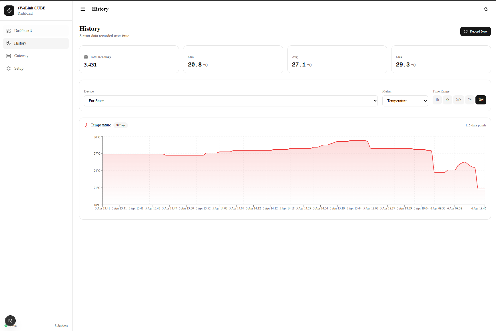
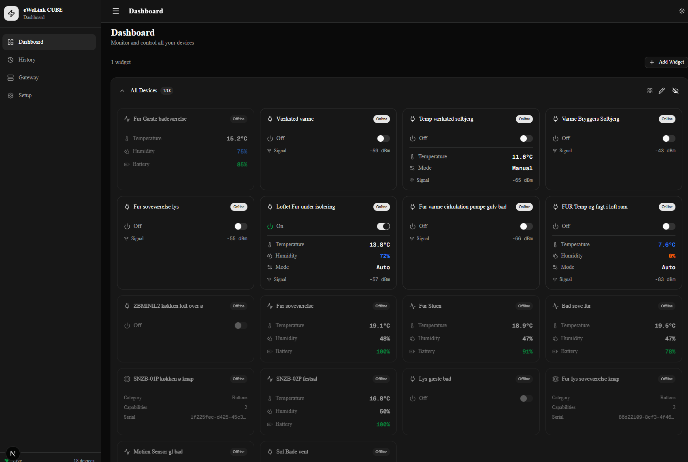

# eWeLink CUBE Dashboard

A self-hosted web dashboard for the [eWeLink CUBE](https://ewelink.cc/) smart-home gateway. Monitor sensors, control switches and lights, and track historical data — all from a single responsive UI.





## Features

- **Real-time device overview** — see every Zigbee device on your CUBE at a glance (temperature, humidity, battery, signal, power state).
- **Live updates** via Server-Sent Events (SSE) — no polling, no refresh.
- **Switch & light control** — toggle power states and adjust brightness / colour directly from the dashboard.
- **Sensor history** — record snapshots to a local SQLite database and browse temperature, humidity, and other metrics over time with interactive charts.
- **Customisable widgets** — pin your most important devices to the dashboard.
- **Gateway info** — CPU, RAM, uptime, firmware version, and network details.
- **Dark / light theme** — follows system preference or manual toggle.
- **Fully local** — runs on your LAN next to the CUBE; no cloud account or internet required after initial setup.

## Tech Stack

| Layer | Tech |
|-------|------|
| Framework | Next.js 16 (App Router, Turbopack) |
| UI | React 19, Tailwind CSS 4, shadcn/ui |
| Charts | Recharts |
| Database | better-sqlite3 (WAL mode) |
| Transport | eWeLink CUBE Open API v2 + SSE |

## Getting Started

### Prerequisites

- **Node.js 20+** and **npm**
- An eWeLink CUBE gateway on the same network

### 1. Clone & install

```bash
git clone https://github.com/japperJ/eWeLink-CUBE-Dashboard.git

cd eWeLink-CUBE-Dashboard
npm install
```

### 2. Configure

Copy the example env file and fill in your CUBE's address:

```bash
cp .env.example .env
```

Edit `.env`:

```env
CUBE_BASE_URL=https://<your-cube-id>.cube.ewelink.cc
CUBE_ACCESS_TOKEN=          # leave blank — get it from the Setup page
```

### 3. Run

```bash
npm run dev
```

Open [http://localhost:3000](http://localhost:3000), go to **Setup**, and follow the wizard to obtain an access token from your CUBE.

### Production build

```bash
npm run build
npm start
```

## Project Structure

```
src/
├── app/              # Next.js App Router pages & API routes
│   ├── api/          # Proxy routes to the CUBE Open API
│   ├── gateway/      # Gateway info page
│   ├── history/      # Sensor history page
│   └── setup/        # Access-token setup wizard
├── components/       # React components
│   ├── devices/      # Device cards (switch, light, sensor, …)
│   ├── gateway/      # Gateway info & system stats
│   ├── layout/       # Header, sidebar, theme toggle
│   ├── providers/    # Context providers (devices, sidebar)
│   ├── ui/           # shadcn/ui primitives
│   └── widgets/      # Dashboard widget system
└── lib/              # Shared helpers, types, DB layer
```

## License

[MIT](LICENSE)
